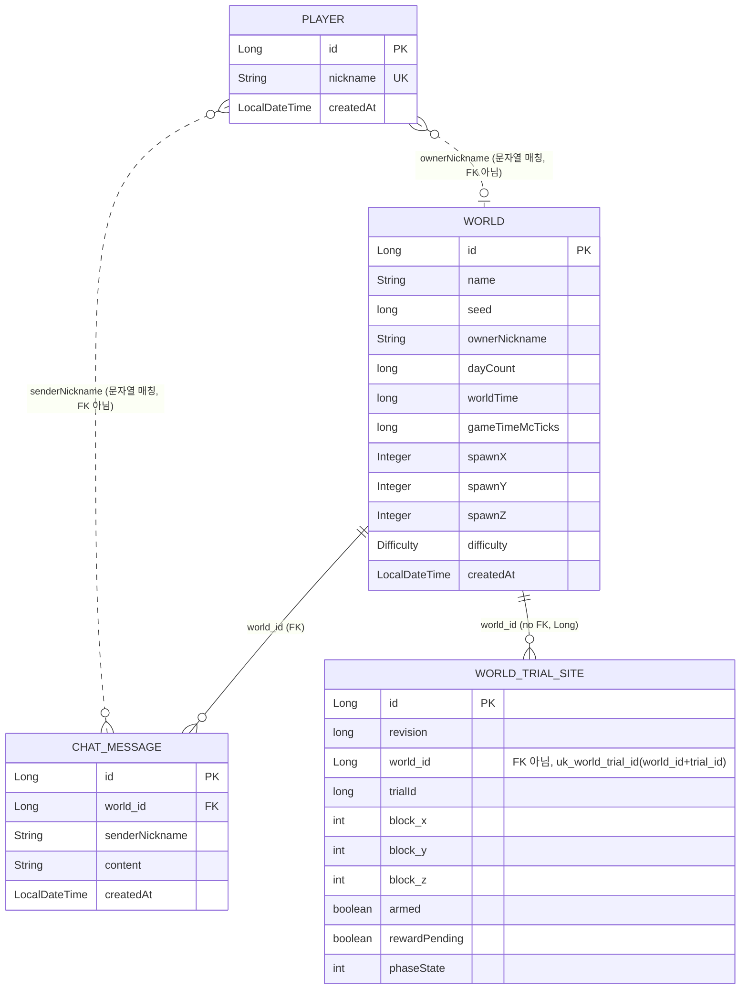

# webcraft — 숙련 주차 과제

Spring Boot + WebSocket + MySQL + Redis 기반 실시간 멀티플레이 게임 서버 과제.
필수 Lv1~15, 도전 Lv16~20 (Lv16 낙관적 락 / Lv17 커서 페이지네이션 / Lv18 Redis 캐시 / Lv19 Redis Lua 레이트리밋 / Lv20 Redis Pub/Sub 멀티 서버 채팅 중계).

## 기술 스택

- Spring Boot, Spring Data JPA (Hibernate), Spring WebSocket
- MySQL 8.4 (Docker)
- Redis 7 (Docker)
- Docker Compose (Lv20, 앱 서버 2대 + MySQL + Redis)


## 실행 방법

```powershell
docker run -d --name webcraft-mysql -p 3307:3306 -e MYSQL_ROOT_PASSWORD=1234 -e MYSQL_DATABASE=webcraft -e TZ=Asia/Seoul mysql:8.4
docker run -d --name webcraft-redis -p 6379:6379 redis:7
```

Lv20(멀티 서버) 확인 시에는 `docker compose up --build`로 앱 서버 2개(app-a:8080, app-b:8081) + MySQL + Redis를 함께 실행합니다.

## ERD

이 프로젝트가 직접 정의한 엔티티는 4개(`Player`, `World`, `ChatMessage`, `WorldTrialSite`)입니다.
webcraft-engine 라이브러리가 자체 관리하는 내부 테이블(월드 생성용 청크 테이블 등)은 이 프로젝트 코드 범위 밖이라 제외했습니다.



## API 명세

전체 스키마: [공식 API 문서](https://f-api.github.io/game-spring-api-docs/expert/api-docs.html)

### REST

| 메서드 | 경로 | 설명 | 레벨 |
|---|---|---|---|
| POST | `/players` | 플레이어(닉네임) 등록 | Lv3 |
| GET | `/worlds/{worldId}/chats?limit=50` | 최근 채팅 조회 | Lv5, Lv6 |
| GET | `/worlds/{worldId}/chats/history` | 과거 채팅 커서 페이지 조회 | Lv17 |

### WebSocket

연결: `ws://localhost:8080/ws/worlds/{worldId}?nickname={nickname}` (Lv7, Lv8)

| 메시지 종류 | 방향 | 레벨 |
|---|---|---|
| ping / pong | 요청 / 응답 | Lv11 |
| 이동 요청 | 요청 | Lv12 |
| 채팅 요청 / 응답 (`type: "chat"`) | 요청 / 응답 | Lv13, Lv14 |
| 접속자 목록 요청 / 응답 | 요청 / 응답 | Lv15 |

## 레벨별 구현 위치

| 레벨 | 내용 | 구현 위치 |
|---|---|---|
| Lv1 | Docker MySQL/Redis 환경 설정 | `application.properties` |
| Lv2 | 채팅 인덱스를 `@Table`/`@Index`로 선언 | `chat/entity/ChatMessage` |
| Lv3 | 플레이어 등록 검증/API | `player/controller/PlayerController`, `player/dto/CreatePlayerRequest`, `player/service/PlayerService` |
| Lv4 | 월드 생성 (동시성 제어 포함) | `world/service/WorldService` |
| Lv5 | 채팅 저장 및 최근 조회 로직 | `chat/service/ChatService` |
| Lv6 | 최근 채팅 조회 API | `chat/controller/WorldChatController` |
| Lv7 | WebSocket 핸드셰이크에서 사용자 식별 | `ws/NicknameHandshakeInterceptor` |
| Lv8 | 핸드셰이크 인터셉터 등록 | `config/WebSocketConfig` |
| Lv9 | 월드별 세션 레지스트리 | `ws/WorldSessionRegistry` |
| Lv10 | Redis 기반 접속 상태 관리 (Sorted Set) | `presence/PresenceService` |
| Lv11 | 메시지 라우팅, ping/pong | `ws/MessageRouter`, `ws/handler/PingWsHandler` |
| Lv12 | 플레이어 이동 처리 | `ws/handler/MoveWsHandler` |
| Lv13 | 채팅 요청 처리/응답 구성 | `ws/handler/ChatWsHandler`, `ws/dto/ChatResponse` |
| Lv14 | 같은 월드 참여자에게 채팅 브로드캐스트 | `chat/service/LocalChatSender` |
| Lv15 | 접속자 목록 조회 | `ws/handler/OnlineUsersWsHandler`, `ws/dto/OnlineUsersResponse` |
| Lv16 (도전) | JPA 낙관적 락 | `trial/entity/WorldTrialSite` |
| Lv17 (도전) | 커서 기반 채팅 페이지 조회 | `chat/service/ChatHistoryService` |
| Lv18 (도전) | Redis 최근 채팅 캐시 (TTL 5초) | `chat/service/RecentChatCache` |
| Lv19 (도전) | Redis Lua 채팅 레이트리밋 (10초당 5건) | `chat/service/ChatRateLimitService` |
| Lv20 (도전) | Redis Pub/Sub 기반 멀티 서버 채팅 중계 | `chat/relay/ChatRelay`, `chat/relay/ChatSubscriptionConfig`, `build.gradle`, `application.properties`, `docker-compose.yml` |